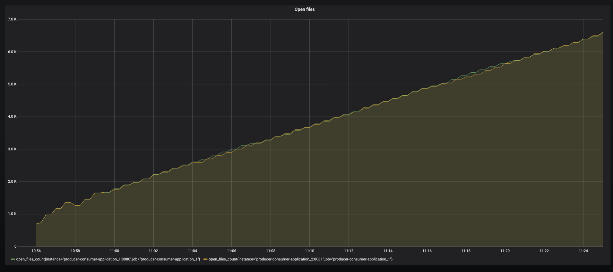
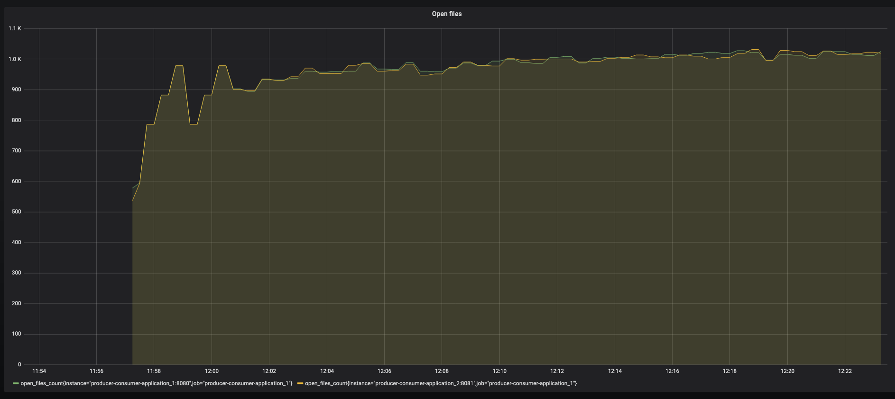

# kafka-9603

Small project replicating [the issue with same name](https://issues.apache.org/jira/browse/KAFKA-9603).

## Requirements:
* docker
* java 11
* maven

### Steps to reproduce:

`mvn clean install`

`export DOCKER_HOST_IP=<local.ip>`

`docker-compose up`

[Open grafana](http://localhost:3000/d/Zb54iIqZk/open-files?panelId=2&fullscreen&orgId=1&refresh=10s). (admin:foobar)

### Additional information

On master branch - after ~ 5 minutes open files count should steadily increase every minute.

On kafka-streams-2.0.1 branch - after ~ 5 minutes open files count relatively stabilizes and remains consistent.

Example graphs:

master:

kafka-streams-2.0.1:

